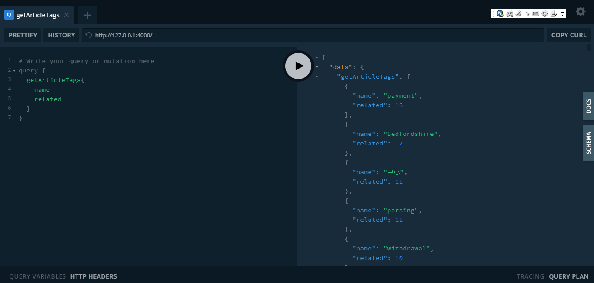

# Gian 个人博客 API

      

# 相关项目

1. [gian-blog 前端站点](https://www.github.com/iamgian-coder/gian-blog)
2. [gian-blog-admin 管理端站点](https://www.github.com/iamgian-coder/gian-blog-admin)

# 技术栈

- ioredis
- koa
- graphql
- apollo
- mongoose

# 开发前的准备

1. 安装 mongodb
2. 安装 redis

# 开发步骤

1. 打开终端并进入项目 src 目录
2. 生成配置文件:cp config.demo.js config.js,并设置值
3. 启动 mongodb 和 redis
4. npm run dev,访问http://127.0.0.1:4000即可在线调试

# 在线调试 graphql 效果图

